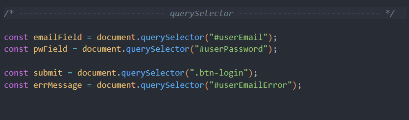

# 네이버 로그인 페이지 구현

---

로그인과 비밀번호를 정확히 입력했을 때 welcome 페이지로 넘어갈 수 있도록 코드 로직을 작성합니다.

---
- [x] 재사용 가능한 함수를 분리하고 함수를 중심으로 설계하는 방법에 대해 학습합니다.

---
리드미 꾸미기 / 제출 방식

과제 완료되면 깃헙에 올리고

깃헙 주소를 구글폼에 제출한다.

구글폼 주소
https://docs.google.com/forms/d/e/1FAIpQLScpXQBd8pTPlCaiqxS_QBXRjhRqHry3pA7MDC-7DhKvAnRR6Q/viewform

---
안녕하십니까 범샘 ..🐯

혼자서 어떻게든 풀어보려 했는데

생각처럼 잘 되지가 않아서 동작이 제대로 되지 않습니다..!

과제 내용에 전체적인 이해도가 많이 부족한 것 같습니다.

추가적인 공부를 해서 꼭 완성시켜 보도록 하겠습니다 😭

---
###코드내용

작성되어 있는 정규 표현식 활용 방법을 정확히 모르는 것 같습니다..

querySelector를 통해 html 내에 아이디와 비밀번호, 제출 내용을 담았습니다.

과제 설명해주신 대로 함수를 작성해보다가

혼란이 와서 이런 괴상한 형태가 되었습니다.

어떻게 연결되는지 정리가 아직 안된것 같습니다 😭😭

나머지 코드도 비슷한 상태입니다.

감사합니다 ...